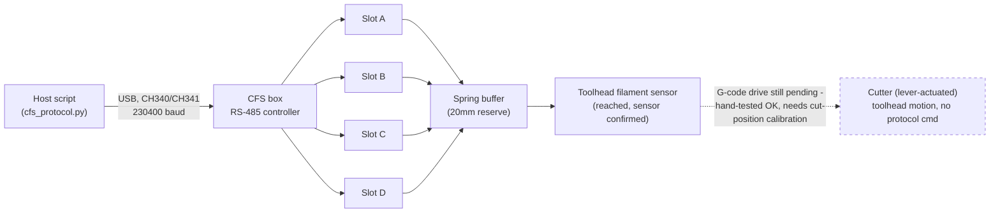
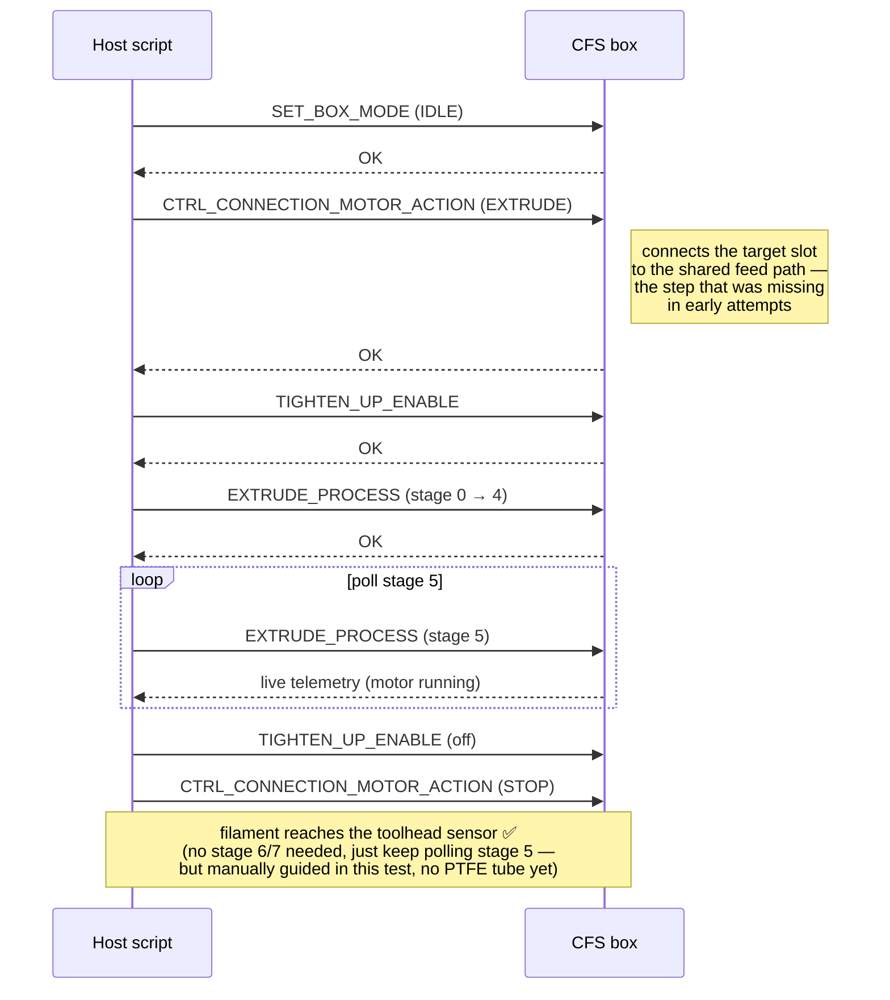

<div align="center">

# K1C CFS without official Creality firmware

[](LICENSE)


[](https://github.com/tomaspakosta/k1c-cfs-klipper/issues)
[](https://paypal.me/pakostatomas)

**Talk directly to a Creality CFS (multi-material filament box) from a K1C
running a community Klipper stack — zero dependency on Creality's official,
closed-source CFS firmware.**

Discovery · addressing · sensors · RFID · `RETRUDE` · `EXTRUDE`
— all working and physically verified on real hardware.

</div>

---

### Contents

[Why does this exist?](#why-does-this-exist) ·
[What we found instead](#what-we-found-instead) ·
[How it fits together](#how-it-fits-together) ·
[Quick start](#quick-start) ·
[Status / what's next](#status--whats-next) ·
[Credits](#credits) ·
[Safety](#safety) ·
[Support](#support)

If you're technical: jump straight to [`docs/PROTOCOL.md`](docs/PROTOCOL.md)
for the full wire protocol and [`examples/`](examples/) for working scripts.
If you're not: keep reading, the next section explains what this actually is
and why it needed to be built at all.

## Why does this exist?

Creality's K1C can be fitted with a **CFS unit** — a box that holds up to 4
spools and feeds whichever one you need for multi-color printing. Officially,
that only works if your printer is running Creality's own firmware, which
includes a piece of software called `box.py` that knows how to talk to the
CFS box.

### How we got here

This started with a CFS retrofit kit on an earlier K1C — a mainboard
revision (`CR4CU220812S12`) that's supposed to natively support CFS, but
whose installed firmware only *identified itself* internally as the older
`S11` variant. In practice that meant real, reproducible hardware errors:
two of the four material slots consistently failed to retract/extrude
(`RETRUDE_ERR7`, `RETRUDE_ERR2`, extrude "blocked at the connections") while
the other two worked fine — and this wasn't a one-off; it reproduced across
manual tests, survived full power-cycles, and happened regardless of which
filament was loaded.

That looked exactly like a firmware/hardware mismatch, and a public Creality
forum thread confirmed other S12-board owners hitting the identical wall.
So: a support ticket to Creality, asking two direct questions — is there a
proper S12 firmware, and does this qualify for a warranty repair.

The reply cycle that followed didn't really answer either one:

- Warranty was declined outright because the printer had been bought
  second-hand with no original proof of purchase — understandable, but it
  closed that door immediately.
- On the firmware question, support repeated *"S11 and S12 use this same
  firmware, don't worry"* and linked a generic flashing tutorial — without
  ever directly confirming the one thing that had actually been asked:
  whether installing S11-branded firmware on an S12 board was officially
  supported and safe, or whether a native S12 build existed at all. Pushed
  a second time for an explicit yes/no on exactly that, the answer was the
  same generic line again, still not a direct confirmation either way.

That's a genuinely risky position to flash from — official-sounding
reassurance with no real commitment behind it, on hardware that isn't
covered if something goes wrong. So flashing anything was ruled out, and the
CFS on that machine stayed unresolved.

Separately, and around the same time, that made it worth reconsidering the
whole approach on a second K1C rather than staying dependent on Creality's
firmware at all. A popular alternative firmware path exists —
[Guilouz's Creality-Helper-Script](https://github.com/Guilouz/Creality-Helper-Script),
which replaces Creality's stack with a more standard, community-maintained
one (mainline-style Klipper, real Moonraker, root access, no telemetry). It's
a genuinely better experience day-to-day — but it never shipped with CFS
support, because Creality never open-sourced the piece that talks to it in
the first place. That's not an oversight on Guilouz's part: Creality only
ever distributes `box.py` as a compiled binary, no source, even though
Klipper (which it's built on) is GPL-licensed and requires source to be
available — a known, long-standing complaint in the community, not just our
opinion (see
[`fake-name/cfs-reverse-engineering`](https://github.com/fake-name/cfs-reverse-engineering)
for the same conclusion from an independent project).

Auditing that second printer confirmed it: no trace of `box.py` anywhere —
not in the live config, not in the ROM factory partition, not in any backup.
The config file even had a comment left behind: `# K1C - Cleaned Macro
Config (Without CFS)`. Someone had deliberately stripped it out at some
point.

So, twice over: physically capable hardware, a CFS unit sitting there ready
to use, and no trustworthy software path to it that didn't mean either
flashing on unclear advice or giving up a better firmware stack entirely.
That's the gap this project fills — build our own, fully open, verified
against real hardware one command at a time.

## What we found instead

The CFS box doesn't need Creality's software to be controlled — it just
needs *something* that speaks its wire protocol correctly. That protocol was
never officially documented, but it didn't need to be reverse-engineered
completely from scratch either: a small but real community of people had
already been chipping away at it independently (see [Credits](#credits)).
We combined their partial results, cross-checked them against each other,
and then validated everything live against real hardware — starting with
pure read-only queries, and only moving on to commands that spin a motor
once we were confident in what we were sending.

**Confirmed working, live, on real hardware:**

| | Capability |
|---|---|
| ✅ | Discovering the box and assigning it an address over the bus |
| ✅ | Reading status, firmware version, and filament sensors |
| ✅ | Reading RFID data per slot *(most non-Creality-branded spools have no chip to read — expected, not a bug)* |
| ✅ | **`RETRUDE`** — reeling filament back onto the spool |
| ✅ | **`EXTRUDE`** — feeding filament from the spool, through the box, past the buffer, and (manually guided into the toolhead at the time, before the PTFE tube was connected) far enough to trigger Klipper's toolhead filament sensor — see the caveat in `docs/PROTOCOL.md` before assuming this was a fully automated feed |
| ✅ | The cutter mechanism itself — hand-tested (not via G-code), confirmed it cleanly cuts filament when its lever is actuated |
| ⏳ | An *automatic* feed through the now-connected PTFE tube (box→buffer→toolhead is physically one continuous path as of the last hardware pass, but not yet re-tested end-to-end without manual guidance), and driving the cutter via G-code instead of by hand — needs real `pre_cut_pos`/`cut_pos` coordinates for this machine first, see [Status / what's next](#status--whats-next) |

## How it fits together

The CFS box connects over **USB**, via a small USB↔RS485 adapter built into
its cable (CH340/CH341 chip). Plug it into any spare USB-A port on the
printer — on Linux, the kernel handles the rest automatically, no driver
install needed. It shows up as `/dev/ttyUSB0` (or similar).



And this is the sequence that actually gets filament moving — the part that
took the most trial and error to work out (full story in
[`docs/PROTOCOL.md`](docs/PROTOCOL.md)):



## Quick start

```bash
pip install pyserial
python examples/01_discover_and_read_sensors.py
```

That script is entirely read-only — safe to run any time to sanity-check
your connection. From there:

- `examples/02_retrude.py` — reels filament back (moves a motor, but the
  "safe" one to start with)
- `examples/03_extrude.py` — feeds filament forward past the buffer (moves a
  motor; read the warning at the top of that file first)
- `examples/04_map_slots.py` — interactively confirms which physical slot
  (A/B/C/D) corresponds to which sensor bit on *your* box (ours came out
  left-to-right, but it's cheap to double-check)

All scripts default to `/dev/ttyUSB0` — edit the `PORT` constant near the
top of each file if yours enumerates differently.

## Status / what's next

This is **not** a Klipper extra (plugin) yet — it's a validated, working
protocol client, meant as the foundation for one.

Since the last update: the PTFE tube from box → buffer → toolhead is now
connected as one continuous path, and the cutter mechanism was manually
tested (pressed by hand, not via G-code) and confirmed working — it's
**lever-actuated**: the toolhead's motion to the cut position is expected to
mechanically press this lever to trigger the blade, rather than purely
dragging filament across a stationary edge as originally assumed from
external reference material. That assumption in `docs/PROTOCOL.md` has been
corrected accordingly.

The remaining hardware is being properly remounted via the official CFS
upgrade kit (the test setup so far has been intentionally loose/temporary)
before the next phase: measuring the real `pre_cut_pos`/`cut_pos`
coordinates for this specific machine so the cut motion can be driven by
G-code instead of by hand.

The plan from here:

1. Remount hardware properly via the upgrade kit, then measure/calibrate
   real cut-position coordinates for this machine.
2. Drive the cut sequence via G-code once those coordinates are known —
   carefully, since moving a real toolhead near an untested position close
   to a blade is genuine physical risk, not something to guess at.
3. Wrap all of this into a real Klipper extra with proper gcode commands and
   background state polling.

See [`docs/PROTOCOL.md`](docs/PROTOCOL.md) for what's documented about the
cutter mechanism so far.

Contributions, corrections, and hardware validation on other CFS/board
revisions are welcome — open an issue.

## Credits

This project stands on real work by other people, not just ours:

- [`ityshchenko/klipper-cfs`](https://github.com/ityshchenko/klipper-cfs) —
  the CRC8/frame-format implementation and a real captured traffic dump we
  validated against, byte for byte.
- [`fake-name/cfs-reverse-engineering`](https://github.com/fake-name/cfs-reverse-engineering) —
  hardware and firmware analysis of the CFS box itself.
- [`gitstonelabs/creality-cfs-klipper`](https://github.com/gitstonelabs/creality-cfs-klipper)
  and
  [`FrederickAlt/CREALITY-K1-AND-K1-MAX-CFS-RETRUDE-BEFORE-CUT-MOD`](https://github.com/FrederickAlt/CREALITY-K1-AND-K1-MAX-CFS-RETRUDE-BEFORE-CUT-MOD) —
  two independent, more mature reimplementations whose documentation is what
  finally unblocked the `EXTRUDE_PROCESS` sequence for us (see
  `docs/PROTOCOL.md` for exactly how).
- [Guilouz/Creality-Helper-Script](https://github.com/Guilouz/Creality-Helper-Script) —
  the community firmware stack all of this runs on top of.

If you're one of the people above and want anything here changed
(attribution, licensing, or otherwise), please open an issue — this exists
to add to that work, not compete with it.

## Safety

Every command in `examples/` that moves a motor says so at the top of the
file, in a comment you'll see before it runs anything. Read it. Keep an eye
on the printer while any motor command is running, and don't leave it
unattended the first few times you try something new — a few of the commands
in this repo were only understood by watching what physically happened when
we sent them, sometimes not what we expected.

## Support

This is free, and the goal is to save the next person the hours we spent
here. If it saved you some and you'd like to say thanks:
[paypal.me/pakostatomas](https://paypal.me/pakostatomas) — entirely
optional, never expected.

## License

GPL-3.0 — see [`LICENSE`](LICENSE). Chosen to match the projects in
[Credits](#credits) this work builds on and cross-references.
