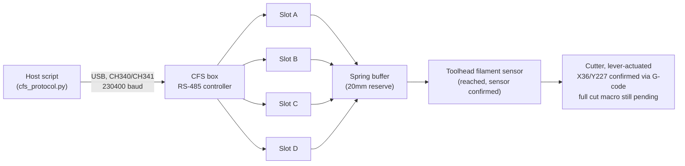
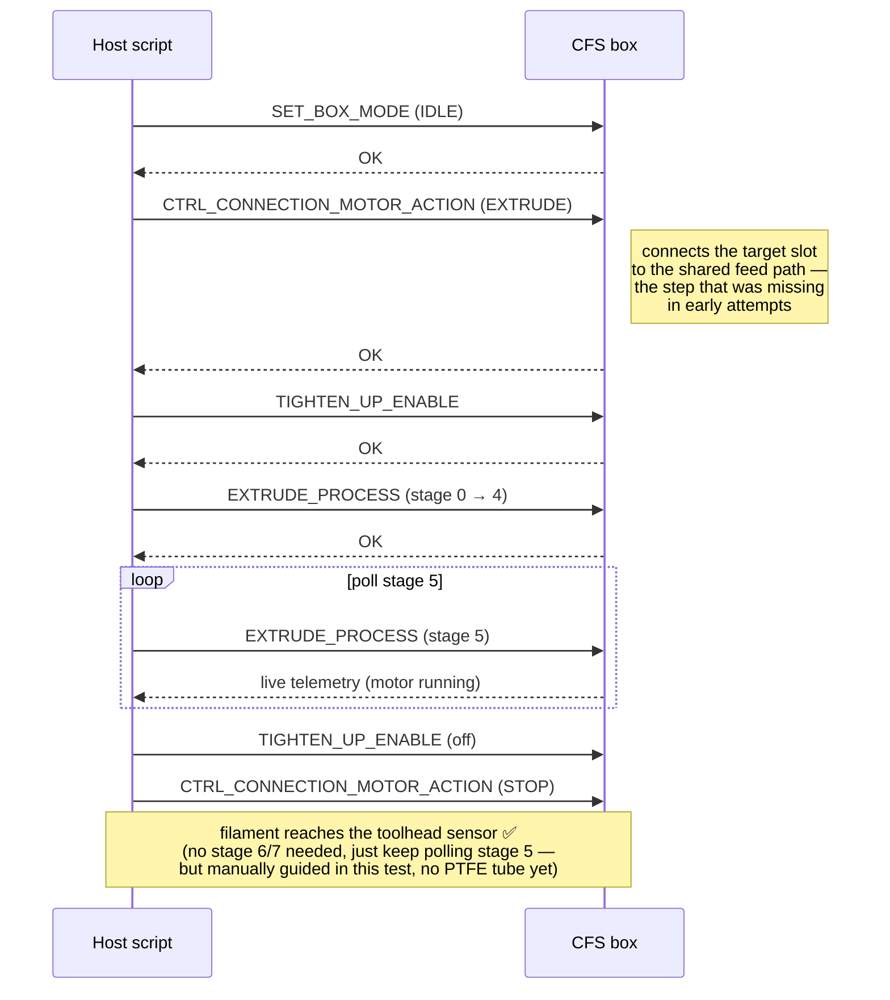

<div align="center">

# K1C CFS without official Creality firmware

[](https://github.com/tomaspakosta/k1c-cfs-klipper/actions/workflows/tests.yml)
[](LICENSE)


[](https://github.com/tomaspakosta/k1c-cfs-klipper/issues)
[](https://paypal.me/pakostatomas)

**Talk directly to a Creality CFS (multi-material filament box) from a K1C
running a community Klipper stack — zero dependency on Creality's official,
closed-source CFS firmware.**

Discovery · addressing · sensors · RFID · `RETRUDE` · `EXTRUDE`
— all working and physically verified on real hardware.

</div>

---

### Contents

[Why does this exist?](#why-does-this-exist) ·
[What we found instead](#what-we-found-instead) ·
[How it fits together](#how-it-fits-together) ·
[Quick start](#quick-start) ·
[Full manual](docs/MANUAL.md) ·
[Status / what's next](#status--whats-next) ·
[Credits](#credits) ·
[Safety](#safety) ·
[Support](#support)

If you're technical: jump straight to [`docs/PROTOCOL.md`](docs/PROTOCOL.md)
for the full wire protocol, [`cfs_cli.py`](cfs_cli.py) for a ready-to-run
tool, or [`examples/`](examples/) for annotated individual scripts.

Setting this up on your own printer? **[`docs/MANUAL.md`](docs/MANUAL.md)**
is the full step-by-step walkthrough, start to finish.
If you're not: keep reading, the next section explains what this actually is
and why it needed to be built at all.

## Why does this exist?

Creality's K1C can be fitted with a **CFS unit** — a box that holds up to 4
spools and feeds whichever one you need for multi-color printing. Officially,
that only works if your printer is running Creality's own firmware, which
includes a piece of software called `box.py` that knows how to talk to the
CFS box.

### How we got here

This started with a CFS retrofit kit on an earlier K1C — a mainboard
revision (`CR4CU220812S12`) that's supposed to natively support CFS, but
whose installed firmware only *identified itself* internally as the older
`S11` variant. In practice that meant real, reproducible hardware errors:
two of the four material slots consistently failed to retract/extrude
(`RETRUDE_ERR7`, `RETRUDE_ERR2`, extrude "blocked at the connections") while
the other two worked fine — and this wasn't a one-off; it reproduced across
manual tests, survived full power-cycles, and happened regardless of which
filament was loaded.

That looked exactly like a firmware/hardware mismatch, and a public Creality
forum thread confirmed other S12-board owners hitting the identical wall.
So: a support ticket to Creality, asking two direct questions — is there a
proper S12 firmware, and does this qualify for a warranty repair.

The reply cycle that followed didn't really answer either one:

- Warranty was declined outright because the printer had been bought
  second-hand with no original proof of purchase — understandable, but it
  closed that door immediately.
- On the firmware question, support repeated *"S11 and S12 use this same
  firmware, don't worry"* and linked a generic flashing tutorial — without
  ever directly confirming the one thing that had actually been asked:
  whether installing S11-branded firmware on an S12 board was officially
  supported and safe, or whether a native S12 build existed at all. Pushed
  a second time for an explicit yes/no on exactly that, the answer was the
  same generic line again, still not a direct confirmation either way.

That's a genuinely risky position to flash from — official-sounding
reassurance with no real commitment behind it, on hardware that isn't
covered if something goes wrong. So flashing anything was ruled out, and the
CFS on that machine stayed unresolved.

Separately, and around the same time, that made it worth reconsidering the
whole approach on a second K1C rather than staying dependent on Creality's
firmware at all. A popular alternative firmware path exists —
[Guilouz's Creality-Helper-Script](https://github.com/Guilouz/Creality-Helper-Script),
which replaces Creality's stack with a more standard, community-maintained
one (mainline-style Klipper, real Moonraker, root access, no telemetry). It's
a genuinely better experience day-to-day — but it never shipped with CFS
support, because Creality never open-sourced the piece that talks to it in
the first place. That's not an oversight on Guilouz's part: Creality only
ever distributes `box.py` as a compiled binary, no source, even though
Klipper (which it's built on) is GPL-licensed and requires source to be
available — a known, long-standing complaint in the community, not just our
opinion (see
[`fake-name/cfs-reverse-engineering`](https://github.com/fake-name/cfs-reverse-engineering)
for the same conclusion from an independent project).

Auditing that second printer confirmed it: no trace of `box.py` anywhere —
not in the live config, not in the ROM factory partition, not in any backup.
The config file even had a comment left behind: `# K1C - Cleaned Macro
Config (Without CFS)`. Someone had deliberately stripped it out at some
point.

So, twice over: physically capable hardware, a CFS unit sitting there ready
to use, and no trustworthy software path to it that didn't mean either
flashing on unclear advice or giving up a better firmware stack entirely.
That's the gap this project fills — build our own, fully open, verified
against real hardware one command at a time.

## What we found instead

The CFS box doesn't need Creality's software to be controlled — it just
needs *something* that speaks its wire protocol correctly. That protocol was
never officially documented, but it didn't need to be reverse-engineered
completely from scratch either: a small but real community of people had
already been chipping away at it independently (see [Credits](#credits)).
We combined their partial results, cross-checked them against each other,
and then validated everything live against real hardware — starting with
pure read-only queries, and only moving on to commands that spin a motor
once we were confident in what we were sending.

**Confirmed working, live, on real hardware:**

| | Capability |
|---|---|
| ✅ | Discovering the box and assigning it an address over the bus |
| ✅ | Reading status, firmware version, and filament sensors |
| ✅ | Reading RFID data per slot *(most non-Creality-branded spools have no chip to read — expected, not a bug)* |
| ✅ | **`RETRUDE`** — reeling filament back onto the spool |
| ✅ | **`EXTRUDE`** — feeding filament from the spool, through the box, through the (now fully connected) PTFE tube, to the toolhead — **confirmed fully automatic**, no manual guidance, `filament_detected: true` in Klipper after re-testing post-upgrade-kit-remount |
| ✅ | The cutter's lever-actuated cut position — found by hand, then **confirmed reproducible with plain `G1` moves**, including after the upgrade-kit remount: retreat and return reliably re-triggers it |
| ✅ | Recovering from a post-run latched error status — a completed `EXTRUDE` can leave the box reporting an error on `GET_BOX_STATE` (LED visibly red) even though it actually succeeded; re-sending `SET_BOX_MODE` (IDLE) clears it, now done automatically at the end of every extrude call in this repo |
| ✅ | **Switching which slot is active — confirmed on all 4 slots (A/B/C/D)** — after 7 failed attempts across 2 sessions (the box seemed to only ever work on slot A), completing `EXTRUDE_PROCESS`'s full sequence (stages 6/7 plus the toolhead-side prime moves between them - see [`docs/PROTOCOL.md`](docs/PROTOCOL.md)) turned out to be the missing piece: our earlier "successes" only ever did the first half. `GET_FILAMENT_SENSOR_STATE`'s CONNECTIONS bank confirmed the box genuinely connected to each requested slot in turn, not just A. See [`docs/TOOLCHANGE_TEST_PLAN.md`](docs/TOOLCHANGE_TEST_PLAN.md) phase 2 for the full (long) debugging trail, including a real regression scare, and always cut before retrude |
| ✅ | **`RETRUDE` no longer jams filament in the toolhead extruder's drive gear** — a "tip-forming" unload sequence (re-shape the filament tip, then retract much further than we originally tried, checking in with the box between chunks) fixed the manual idler-lever-release failure mode. **Confirmed live**: two consecutive extrude→cut→retrude cycles both retracted fully automatically, no manual assist — see [`docs/PROTOCOL.md`](docs/PROTOCOL.md)'s "RETRUDE — the tip-forming unload sequence" |
| ⏳ | A full cut *macro* and the combined toolchange sequence — individual pieces (including slot switching) are now proven; phases 3-4 (turning it into `CFS_TOOLCHANGE`/`CFS_FLUSH` macros) are next |

## How it fits together

The CFS box connects over **USB**, via a small USB↔RS485 adapter built into
its cable (CH340/CH341 chip). Plug it into any spare USB-A port on the
printer — on Linux, the kernel handles the rest automatically, no driver
install needed. It shows up as `/dev/ttyUSB0` (or similar).



And this is the sequence that actually gets filament moving — the part that
took the most trial and error to work out (full story in
[`docs/PROTOCOL.md`](docs/PROTOCOL.md)):



## Quick start

Fastest path — copy [`scripts/selftest.sh`](scripts/selftest.sh) onto the
printer and run it there (read it first, then):

```bash
scp scripts/selftest.sh root@<printer-ip>:/tmp/
ssh root@<printer-ip> sh /tmp/selftest.sh
```

It detects your Python/pyserial setup, finds the CFS's USB device
automatically, and runs a **read-only** self-test (discovery, addressing,
sensor/version reads) — confirmed working against real hardware, never
moves a motor. If it can't reach GitHub over HTTPS from the printer itself
(common on this class of firmware — see the script's own comments), it'll
tell you to `scp` `cfs_protocol.py` over instead and re-run.

Then, the friendliest way to actually use this — one tool, a menu if you
just run it, or subcommands if you want to script it:

```bash
pip install pyserial

python cfs_cli.py                    # interactive menu
python cfs_cli.py status             # read-only, scriptable
python cfs_cli.py retrude --slot A   # moves a motor - asks to confirm interactively
python cfs_cli.py extrude --slot A --polls 20
python cfs_cli.py map-slots
```

`status` and `map-slots` are read-only. `retrude`/`extrude` move a motor —
in the interactive menu they ask you to confirm first; run non-interactively
(as above) they don't prompt, since a script can't answer a prompt — only
automate those once you've verified the command by hand and are comfortable
running it unattended.

If you'd rather read/copy individual pieces instead of using the CLI, the
same functionality exists as separate annotated scripts in
[`examples/`](examples/):

- `examples/01_discover_and_read_sensors.py` — read-only sanity check
- `examples/02_retrude.py` — reels filament back (moves a motor, but the
  "safe" one to start with)
- `examples/03_extrude.py` — feeds filament forward past the buffer (moves a
  motor; read the warning at the top of that file first)
- `examples/04_map_slots.py` — interactively confirms which physical slot
  (A/B/C/D) corresponds to which sensor bit on *your* box (ours came out
  left-to-right, but it's cheap to double-check)

Both the CLI and the examples auto-detect the CFS's serial port (matching
its CH340/CH341 USB vendor ID) and print which one they picked — pass
`--port` (CLI) or set the `PORT` constant (examples) explicitly if you have
another CH340 device plugged in too and auto-detect picks the wrong one.

No hardware needed to check the framing/CRC logic itself — it's tested
against real captured traffic:

```bash
pip install -r requirements-dev.txt
pytest tests/ -v
```

## Status / what's next

This is **not** a Klipper extra (plugin) yet — it's a validated, working
protocol client, meant as the foundation for one.

Since the last update: the CFS upgrade kit is now properly mounted (the
earlier test setup was intentionally loose/temporary), the PTFE tube from
box → buffer → toolhead is connected as one continuous path, and the cutter
mechanism has been both hand-tested and **confirmed reproducible via pure
G-code**. It's **lever-actuated**: the toolhead's motion to a specific
position mechanically presses a lever to trigger the cut, rather than
dragging filament across a stationary edge as originally assumed from
external reference material for a different hardware revision — that
assumption in `docs/PROTOCOL.md` has been corrected.

The real cut position was found by jogging the toolhead by hand (via the
printer's touchscreen, which preserves Klipper's position tracking — no
steppers disabled) until the lever was visibly pressed, then reading the
exact coordinates back from Klipper — currently **`X=36.0, Y=227.0`** on
our unit (this changed once already, from an original `X=150.0, Y=225.0`,
after further hardware handling shifted things — see `docs/PROTOCOL.md`'s
cutter section). Notably different either way from `X=42.0` in an older
reference config for a different physical printer, which is exactly why
this is worth measuring directly rather than assuming, and **worth
re-measuring any time you handle the printer**, not just once. Retreating
and re-approaching the current position purely via `G1` commands reliably
re-triggers the lever every time.

Also now in place, all **drafts pending supervised testing at the
printer** (none run even once yet, clearly marked as such in each file):

- [`klipper_extra/creality_cfs.py`](klipper_extra/creality_cfs.py) — a
  real Klipper extra: `CFS_STATUS`/`CFS_RETRUDE`/`CFS_EXTRUDE` gcode
  commands, a background status poll, and per-slot virtual
  `filament_switch_sensor` objects so Fluidd/Mainsail show CFS material
  presence natively. The protocol calls are the validated ones from this
  repo; the Klipper integration itself hasn't been loaded into a real
  Klipper yet.
- [`macros/cut_macro_draft.cfg`](macros/cut_macro_draft.cfg) — a cut
  sequence around the confirmed lever position (pre-retraction, multiple
  passes, temporary acceleration limits), modeled on
  [`FrederickAlt`'s cutter reference docs](https://github.com/FrederickAlt/CREALITY-K1-AND-K1-MAX-CFS-RETRUDE-BEFORE-CUT-MOD/blob/master/docs/unload-cutter-sensor-reference.md).
- [`macros/toolchange_draft.cfg`](macros/toolchange_draft.cfg) — a first
  `CFS_TOOLCHANGE` macro combining cut → retrude old → extrude new, based
  on the real cut/retrude/load/flush/restore order documented in
  [`FrederickAlt`'s material-change-flow.md](https://github.com/FrederickAlt/CREALITY-K1-AND-K1-MAX-CFS-RETRUDE-BEFORE-CUT-MOD/blob/master/docs/material-change-flow.md).
  Remembers the active slot across calls via Klipper's `save_variables`,
  so you don't have to pass `FROM=` by hand every time.
- [`macros/flush_draft.cfg`](macros/flush_draft.cfg) — `CFS_FLUSH`, a
  purge push through the printer's own extruder after a toolchange. **The
  least-validated piece in this repo** — there's no empirical data behind
  it at all yet, not even a manual test, only "something like this belongs
  here" from the reference docs.
- [`macros/tool_aliases_draft.cfg`](macros/tool_aliases_draft.cfg) — wires
  `T0`-`T3` to `CFS_TOOLCHANGE` + `CFS_FLUSH` for eventual slicer use, once
  both of those are independently trusted by hand first.

[`docs/TOOLCHANGE_TEST_PLAN.md`](docs/TOOLCHANGE_TEST_PLAN.md) has the
full staged, supervised order to test all of this in — individual pieces,
then a manual sequence, then the swap macro alone, and only then flush and
`T0`-`T3` together. It also has what's known to work on the OrcaSlicer
side from prior work on different hardware (`manual_filament_change: 0`,
sequential `T0..T3` → slot A..D mapping) for once that point is reached —
none of it usefully testable before `T0`-`T3` themselves work by hand.

See [`docs/PROTOCOL.md`](docs/PROTOCOL.md) for what's documented about the
cutter mechanism, and [`docs/MANUAL.md`](docs/MANUAL.md) for the full
setup walkthrough.

Contributions, corrections, and hardware validation on other CFS/board
revisions are welcome — open an issue.

## Credits

This project stands on real work by other people, not just ours:

- [`ityshchenko/klipper-cfs`](https://github.com/ityshchenko/klipper-cfs) —
  the CRC8/frame-format implementation and a real captured traffic dump we
  validated against, byte for byte.
- [`fake-name/cfs-reverse-engineering`](https://github.com/fake-name/cfs-reverse-engineering) —
  hardware and firmware analysis of the CFS box itself.
- [`gitstonelabs/creality-cfs-klipper`](https://github.com/gitstonelabs/creality-cfs-klipper)
  and
  [`FrederickAlt/CREALITY-K1-AND-K1-MAX-CFS-RETRUDE-BEFORE-CUT-MOD`](https://github.com/FrederickAlt/CREALITY-K1-AND-K1-MAX-CFS-RETRUDE-BEFORE-CUT-MOD) —
  two independent, more mature reimplementations whose documentation is what
  finally unblocked the `EXTRUDE_PROCESS` sequence for us (see
  `docs/PROTOCOL.md` for exactly how). `gitstonelabs`'s purge-length formula
  and cycle-split model (reverse-engineered from the compiled stock box
  wrapper binary) is what `macros/flush_draft.cfg` is built on — see that
  file's header for the details and cross-checks.
- [Guilouz/Creality-Helper-Script](https://github.com/Guilouz/Creality-Helper-Script) —
  the community firmware stack all of this runs on top of.

If you're one of the people above and want anything here changed
(attribution, licensing, or otherwise), please open an issue — this exists
to add to that work, not compete with it.

## Safety

Every command in `examples/` that moves a motor says so at the top of the
file, in a comment you'll see before it runs anything. Read it. Keep an eye
on the printer while any motor command is running, and don't leave it
unattended the first few times you try something new — a few of the commands
in this repo were only understood by watching what physically happened when
we sent them, sometimes not what we expected.

## Support

This is free, and the goal is to save the next person the hours we spent
here. If it saved you some and you'd like to say thanks:
[paypal.me/pakostatomas](https://paypal.me/pakostatomas) — entirely
optional, never expected.

## License

GPL-3.0 — see [`LICENSE`](LICENSE). Chosen to match the projects in
[Credits](#credits) this work builds on and cross-references.
